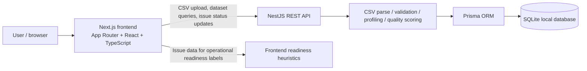

# QualiCare

QualiCare is a local healthcare appointment-data quality inspection application for reviewing CSV datasets before they are used in operational workflows. It validates structural issues and field-level problems, stores uploaded datasets and findings in SQLite, calculates a transparent quality score, profiles columns, and helps teams review and classify data issues by status.

This project is intentionally narrow in scope. It is not an electronic health record, not a clinical decision-support system, not a medical diagnostic tool, and not a production healthcare platform. It does not automatically correct source data or claim clinical validity.

## Why QualiCare exists

Healthcare appointment data often arrives in imperfect CSV files: missing identifiers, malformed dates, invalid statuses, duplicate appointment IDs, or inconsistent contact data. Before downstream scheduling, reporting, and operational use, teams need a simple, transparent first-pass quality review.

QualiCare addresses that gap by:

- accepting appointment-style CSV data locally
- validating required structure and field values
- persisting uploaded datasets and associated findings in a local database
- calculating a reproducible quality score from the actual validation results
- profiling each column for completeness, inferred type, uniqueness, and sample values
- supporting issue review and status tracking without altering the source CSV

## Key features

- CSV upload with a 5 MB file-size limit
- backend validation for required headers, missing values, invalid emails, invalid dates, invalid statuses, and duplicate records
- dataset history and per-dataset detail views
- persisted validation findings in Prisma + SQLite
- quality scoring based on error-bearing records, with warnings excluded from the score
- column profiling for inferred type, completeness, missing values, unique values, and sample values
- issue search and severity filtering in the frontend
- report export as CSV
- issue status workflow: OPEN, RESOLVED, and IGNORED
- operational readiness assessment mapped from issue categories to practical downstream-use risk

## Operational Readiness

Operational readiness is a separate concept from the numeric quality score. The application maps active findings to practical operational risk categories such as patient identification, scheduling integrity, appointment workflow, communication data, and record uniqueness.

This is a decision-support label for working with the data, not a claim that the data is clinically correct or appropriate for patient outcomes. Readiness is useful for operational triage, not diagnosis or care decisions.

The frontend currently calculates readiness from active issue data and risk-group mappings. It is heuristically derived from the validation findings, not from a separate clinical or regulatory model.

## Quality Score methodology

The backend quality score is intentionally simple and transparent. It is a heuristic, not a clinically validated metric.

The current logic is:

1. If the dataset is empty, return 0.
2. If any `MISSING_COLUMN` error is present, return 0.
3. Count each record once if it has one or more ERROR-level findings.
4. Ignore WARNING findings when calculating the score.
5. Compute the percentage of records without any ERROR findings.

Current formula in simplified form:

`score = (records_without_error_findings / total_rows) * 100`

This means:

- warnings do not reduce the quality score
- records with one or more ERROR findings count once against the score
- missing required columns force the score to 0
- an empty dataset scores 0

| Behavior | Result |
|---|---|
| Warning-only findings | No score reduction |
| One or more ERROR findings on a record | Record counts as affected once |
| Missing required column(s) | Score forced to 0 |
| Empty dataset | Score forced to 0 |
| RESOLVED/IGNORED status changes | Does not recalculate the underlying source CSV |

## Column Profiling

The backend profiles each column using the records in the dataset. It tracks:

- inferred data type
- total values
- non-empty values
- missing values
- completeness percentage
- unique values
- sample values

Inferred types currently supported by the implementation include:

- `INTEGER`
- `DECIMAL`
- `DATE`
- `BOOLEAN`
- `TEXT`

This profiling is based on value heuristics and is intended for dataset triage and review, not for guaranteed schema validation.

## Data-quality rules currently implemented

The backend validation logic currently checks the following patterns in appointment-style CSV data. The exact issue types in the current source are:

| Issue type | Meaning | Severity |
|---|---|---|
| `MISSING_COLUMN` | Required column missing from the CSV header | ERROR |
| `MISSING_VALUE` | Required field value is empty | ERROR |
| `INVALID_EMAIL` | `patient_email` value is malformed | ERROR |
| `INVALID_DATE` | `appointment_date` is not a valid `YYYY-MM-DD` date | ERROR |
| `INVALID_STATUS` | `appointment_status` is not one of the recognized values | ERROR |
| `DUPLICATE_RECORD` | Same `appointment_id` appears more than once | WARNING |

Current required fields for this appointment-oriented schema are:

- `patient_id`
- `appointment_id`
- `appointment_date`
- `appointment_status`

The validation rules are intentionally limited to this appointment dataset pattern.

### Sample dataset result

The included sample file at `sample-data/appointments.csv` is expected to produce five findings in the current implementation:

- invalid patient email -> `ERROR`
- invalid appointment date -> `ERROR`
- invalid appointment status -> `ERROR`
- missing patient ID value -> `ERROR`
- duplicate appointment ID -> `WARNING`

Those findings are the expected result for the included sample file, not a universal statement about all appointment data.

## Issue workflow

The persisted issue model contains a `status` field, and the current backend allows three values:

- `OPEN`
- `RESOLVED`
- `IGNORED`

The backend exposes a status-update endpoint:

`PATCH /datasets/:datasetId/issues/:issueId/status`

This updates the persisted issue status in SQLite. It does not reparse, revalidate, or rewrite the original CSV file, and it does not change the underlying source data. The workflow is a review/triage mechanism for the persisted findings, not a data-correction engine.

In the current implementation, the UI includes the three status states and allows manual toggling. For readiness calculations, the code currently excludes `RESOLVED` issues from active readiness counts, while `IGNORED` remains in the active issue set unless adjusted in future code. This is the current behavior visible in the source, not a claim that ignored issues are automatically neutralized.

## Architecture

The application is a small, local two-tier system:



Notes:

- the frontend is the user-facing dashboard and issue workflow UI
- the NestJS backend handles dataset persistence and API endpoints
- CSV parsing, validation, profiling, and quality scoring happen in backend services
- readiness categorization is calculated in the frontend from active issue data
- the database is SQLite and is intentionally local to the repository workspace

## Technology stack

| Layer | Current implementation |
|---|---|
| Frontend | Next.js 16, React 19, TypeScript |
| Backend | NestJS, TypeScript |
| Data persistence | Prisma ORM with SQLite |
| CSV parsing | `csv-parse` |
| Database setup | Prisma migrations and Prisma schema |
| Validation / scoring | TypeScript services in backend `quality` modules |
| Styling | custom CSS in the Next.js app |

## Repository structure

```text
.
├── apps/
│   ├── backend/
│   │   ├── prisma/
│   │   │   ├── migrations/
│   │   │   ├── schema.prisma
│   │   │   └── .env.example
│   │   ├── src/
│   │   │   ├── prisma/
│   │   │   ├── quality/
│   │   │   ├── app.controller.ts
│   │   │   ├── app.module.ts
│   │   │   ├── app.service.ts
│   │   │   └── main.ts
│   │   ├── .gitignore
│   │   ├── package.json
│   │   └── prisma.config.ts
│   └── frontend/
│       ├── src/app/
│       ├── package.json
│       └── next.config.ts
├── sample-data/
│   ├── appointments.csv
│   └── incomplete.csv
├── .gitignore
├── README.md
└── docs/
```

## API endpoints

The current backend exposes the following routes from `DatasetController` and the root app controller.

| Method | Path | Purpose |
|---|---|---|
| `POST` | `/datasets/upload` | Upload a CSV file, validate file type and size, parse CSV, run validation, and persist the dataset and findings |
| `GET` | `/datasets` | List uploaded datasets and summary metadata |
| `GET` | `/datasets/:id` | Return a dataset with its records, issue list, and column profiles |
| `PATCH` | `/datasets/:datasetId/issues/:issueId/status` | Update an issue status to `OPEN`, `RESOLVED`, or `IGNORED` |

Important API behavior:

- upload route accepts CSV only
- file size limit is 5 MB
- validation results are persisted and returned as dataset findings
- status updates persist through the backend and update the issue record in SQLite
- source CSV files are not revalidated or rewritten during issue-status updates

## Getting started / local setup

This repository is organized as two app folders, each with its own dependencies. There is no root-level package manager setup.

### 1. Install backend dependencies

```bash
cd apps/backend
npm install
```

### 2. Configure the local environment

Copy the example environment file into a local `.env` file:

```bash
cp .env.example .env
```

On Windows PowerShell:

```powershell
Copy-Item .env.example .env
```

The current example file contains:

```env
DATABASE_URL="file:./dev.db"
```

### 3. Generate the Prisma client

```bash
npx prisma generate
```

### 4. Apply the tracked SQLite migrations

```bash
npx prisma migrate deploy
```

This creates the local SQLite database from the repository's migrations and leaves the database uncommitted by design.

### 5. Start the backend

```bash
npm run start:dev
```

The backend currently listens on `http://localhost:3000`.

### 6. Install frontend dependencies

```bash
cd ../frontend
npm install
```

### 7. Start the frontend

Use the local dev workflow expected by the current codebase:

```bash
npm run dev -- --port 3001
```

The frontend source hard-codes the backend API URL as `http://localhost:3000`, and the backend CORS configuration allows browser requests from `http://localhost:3001`. Running the frontend on port 3001 matches the current local setup.

## Environment configuration

| Setting | Value | Notes |
|---|---|---|
| `DATABASE_URL` | `file:./dev.db` | Local SQLite database in `apps/backend/prisma` |
| Backend port | `3000` | `apps/backend/src/main.ts` listens here |
| Frontend port | `3001` | Current local workflow matches backend CORS origin |
| Upload limit | 5 MB | Enforced in backend `DatasetController` |

The database file and `.env` file are intentionally ignored in the repo; they are local development artifacts.

## Running backend and frontend

From a fresh clone:

```bash
cd apps/backend
npm install
Copy-Item .env.example .env
npx prisma generate
npx prisma migrate deploy
npm run start:dev
```

Then in another terminal:

```bash
cd apps/frontend
npm install
npm run dev -- --port 3001
```

Open the frontend in the browser at:

`http://localhost:3001`

Then upload a CSV file and inspect the dataset in the dashboard.

## Running tests

The current backend test suite is the substantive automated validation present in this repo.

From `apps/backend`:

```bash
npm test
```

Current validated status in this repository:

- 5 test files passed
- 21 tests passed
- backend production build passed
- frontend production build passed

There are no frontend Jest/Vitest specs in the current codebase, so frontend UI coverage is not claimed.

## Sample datasets

The repository includes sample data under `sample-data/`:

- `sample-data/appointments.csv` — appointment-style demonstration dataset containing intentional quality issues used to exercise the validation rules
- `sample-data/incomplete.csv` — intentionally incomplete header set that triggers missing-column validation

The included appointment sample is designed to reproduce the current rule set and demonstrates the expected detection behavior in the current app.

## Privacy and healthcare-data boundary

QualiCare is designed for local review of synthetic healthcare appointment data. It is not a production-grade healthcare platform and should not be treated as a compliant data-processing system for patient care or regulated clinical workflows.

Important boundary notes:

- the project is local-first and does not include user authentication or multi-user ownership
- data is stored in a local SQLite database, not a governed production datastore
- the software does not claim to validate clinical correctness or patient outcomes
- the app does not automatically modify source data or patient records
- the project is not a HIPAA-certified or regulatory-compliance product

## Current limitations

This project is useful for local inspection and triage, but it has real constraints:

- SQLite is used for local development persistence, not production-grade multi-user storage
- the schema and validation rules are narrow and appointment-oriented
- there is no authentication or user-based ownership model
- there is no automatic correction or source-data rewrite workflow
- the quality score is a heuristic transparency metric, not a clinical or evidence-based quality standard
- the operational-readiness view is a practical risk screen, not a patient-safety assessment
- no broader healthcare domain models are implemented beyond the current CSV rule set
- there is no external API integration, EHR linkage, or clinical validation layer

## Future improvements / roadmap

Potential next steps for a more robust version of the project include:

- configurable validation rule sets by dataset type or organization
- stronger schema/field configuration beyond the current appointment template
- authentication and multi-user access controls
- production-grade database, storage, and deployment configuration
- larger-file and streaming processing for bigger CSV inputs
- expanded audit/history features for issue status changes and dataset lineage
- broader healthcare data coverage beyond appointment records
- richer operational-readiness calculations tied to configurable business policies

These are future directions, not current capabilities.

